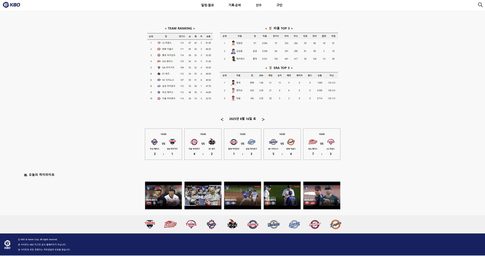
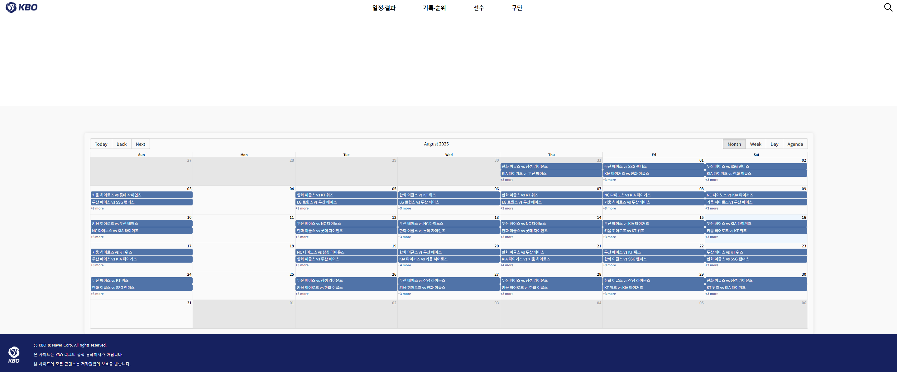
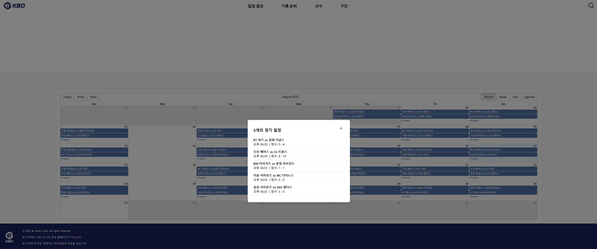
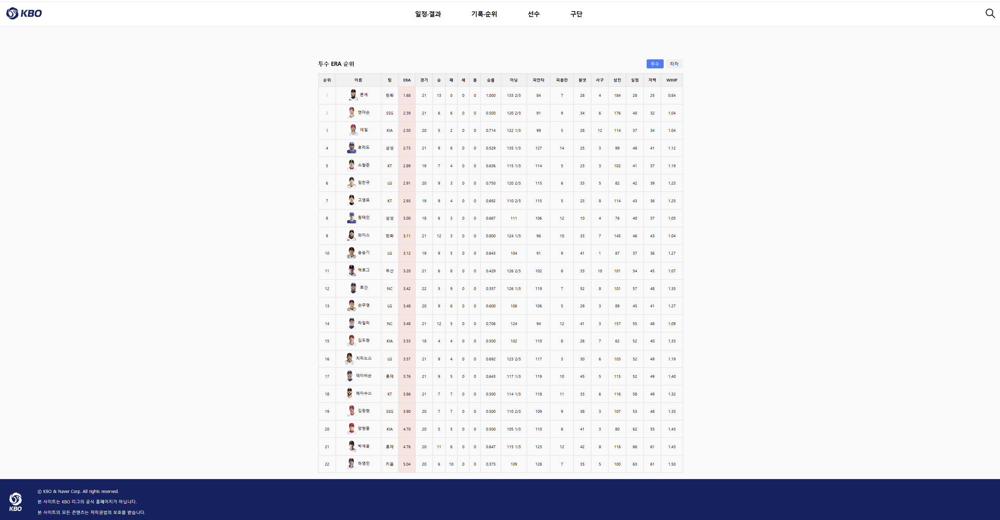
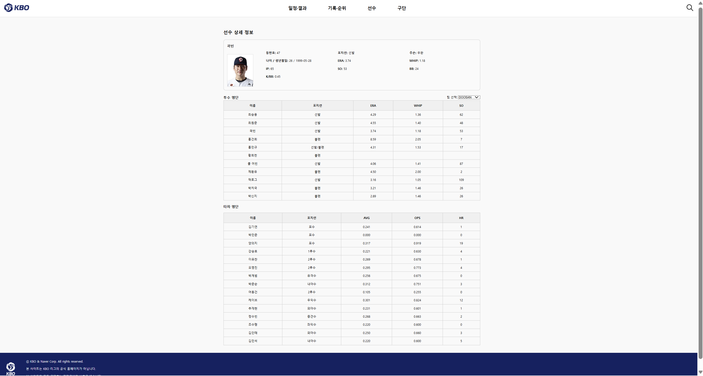
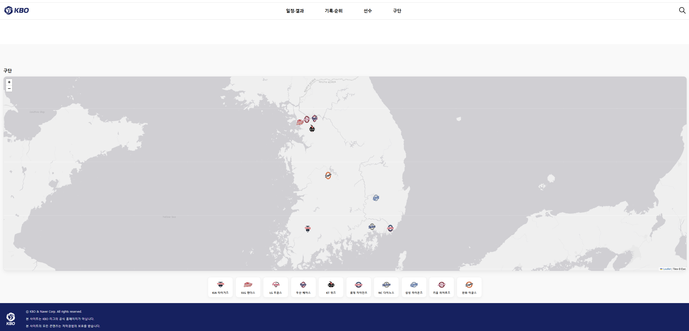
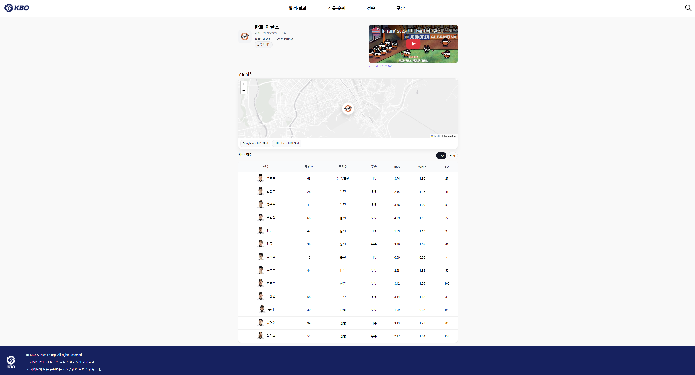
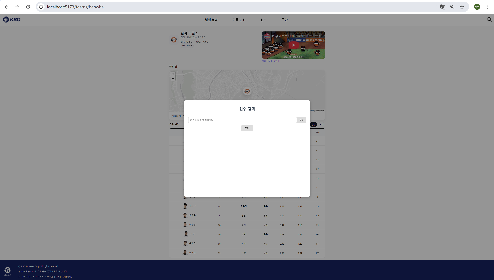

# ⚾ KBO 프로젝트

최근 핫한 **KBO(한국 프로야구)** 의 정보를 제공하는 사이트입니다.

팀 랭킹, 선수 순위, 경기 일정, 하이라이트 기능을 한눈에 확인할 수 있습니다.

React + TypeScript 기반으로 제작하였으며, 직관적인 UI로 사용자들이 쉽게 정보를 얻을 수 있도록 구현했습니다.

---

## 주요 기능

- **팀 랭킹** : 팀 순위를 실시간으로 확인 가능
- **선수 순위** : 타자/투수별 주요 스탯 성적 및 순위 제공
- **경기 일정** : 캘린더 기반으로 직관적인 경기 일정 조회
- **하이라이트** : 경기별 주요 영상 및 하이라이트 확인
- **구단 정보** : 각 구단 위치 및 선수 확인
- **선수 검색 기능** : 검색을 통해 선수 간단 성적 확인

---

## 페이지 소개

### 1. 홈 화면

KBO 주요 소식을 한눈에 볼 수 있는 메인 화면입니다.

헤더에는 좌측에 로고 가운데에 페이지 우측에 선수 검색 이모지를 만들었고 푸터에는 로고와 간단한 글로 디자인했습니다.

홈 화면에는 팀 실시간 랭킹과 타자의 타율 top3 & 투수 ERA TOP 3 표가 있고 그 밑에 경기 일정박스를 만들었습니다. < 이 기호를 누르면 전날 기록을 > 이 기호를 누르면 다음날 일정을 확인할 수 있습니다.

하이라이트는 클릭 시 유튜브 페이지로 넘어가고 그 밑에 팀 로고를 클릭하면 구단 상세 페이지로 이동합니다.

---

### 2. 팀 랭킹 페이지

  

경기 일정을 캘린더로 확인할 수 있는 페이지입니다.

경기 일정을 react-big-calender 라이브러리를 사용해 구현했습니다.
경기 일정이 칸마다 간단히 표시되고 클릭 시 상세 모달을 통해 상세 일정을 확인할 수 있습니다.

---

### 3. 선수 순위 페이지

타자와 투수의 기록을 확인하는 페이지입니다.

타자 및 투수의 개인 기록과 타자의 타율 & 투수의 ERA 순위를 볼 수 있습니다. 순위를 결정하는 스탯 칸에는 색 차이를 두었고 1 ~ 3등은 금, 은, 동을 연상하는 색으로 꾸몄습니다. 버튼을 통해 투수와 타자의 스탯을 선택해 확인 할 수 있습니다.

---

### 4. 선수 성적 페이지

  
선수의 세부 스탯을 구단별로 확인할 수 있는 페이지입니다.

필터를 통해 팀을 선택하고 나열되어 있는 선수를 클릭하면 빈 박스의 선수의 이미지와 세부 스탯을 나타내는 기능을 구현했습니다.

---

### 5. 구단 정보 페이지

구단의 위치와 구단을 선택하는 페이지입니다.

Leaflet 라이브러리를 사용해 지도를 나타내고 그 위에 구단 로고를 구장 좌표에 맞게 표시했습니다. 지도 위 로고를 클릭하거나 지도 밑에 나열된 구단을 클릭하면 구단 상세 페이지로 이동하게 됩니다.

구단 상세 페이지에는 각 구단의 연고지와 팀 창설 연도, 현재 감독, 공식 사이트를 로고 오른쪽에 표시했고 유튜브 API를 사용해 응원가를 페이지에서 재생할 수 있게 했습니다. 구단 선택 페이지에서 사용한 라이브러리를 여기서도 재 사용해 미니맵을 만들었고 버튼을 통해 구단의 위치를 네이버 지도나 카카오맵으로도 확인 가능합니다. 그 밑에는 구단의 선수 명단을 나타냈습니다.

### 6. 선수 검색창

선수를 검색할 수 있는 모달입니다.

헤더의 돋보기 이모지를 클릭하면 모달을 띄울 수 있고, 선수 명 검색을 통해 간단한 선수 정보와 이미지를 확인할 수 있습니다.

검색은 검색 버튼을 클릭하거나 엔터를 누르면 검색이 가능합니다.

모달 창 닫기는 닫기 버튼을 클릭하거나 바깥 배경 클릭, esc 클릭 시 창이 닫힙니다.

---

## 기술 스택

- **Frontend** : React, TypeScript
- **UI 라이브러리** : React Big Calendar, Leaflet

---
